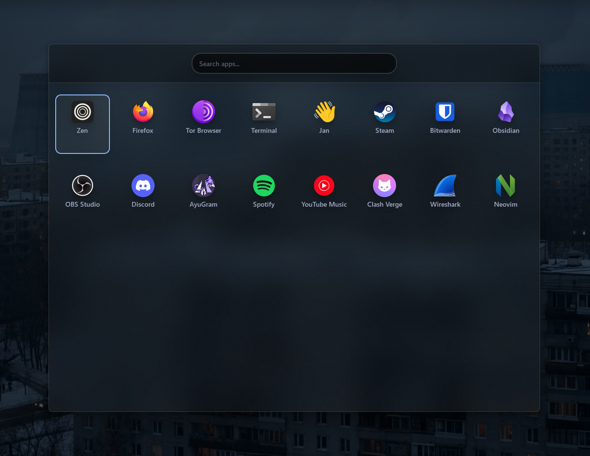
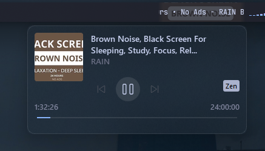
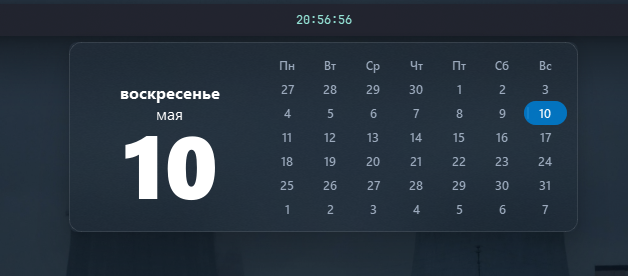
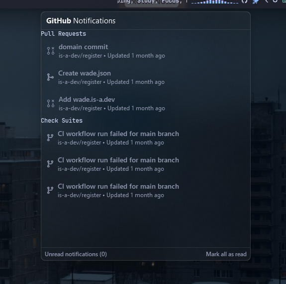
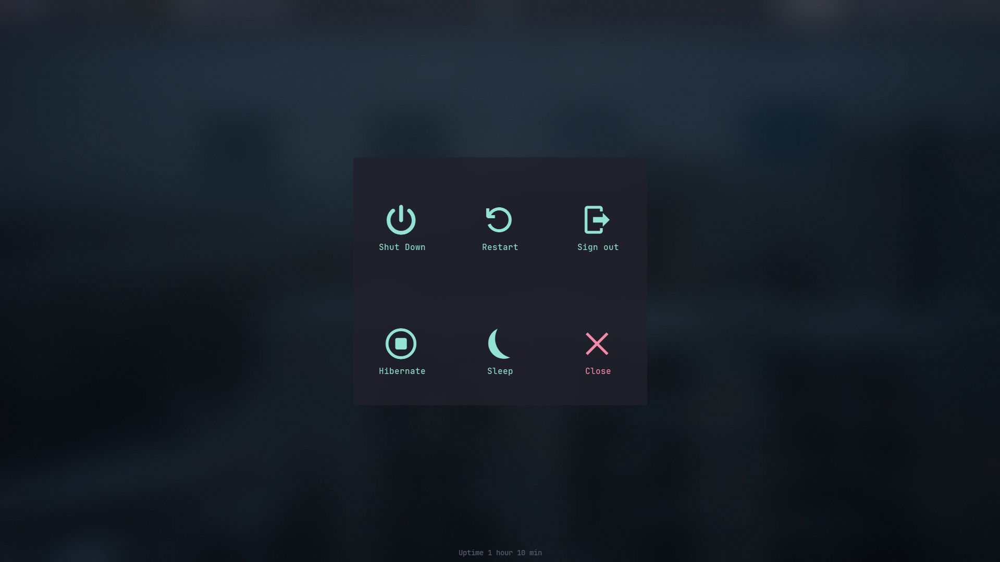
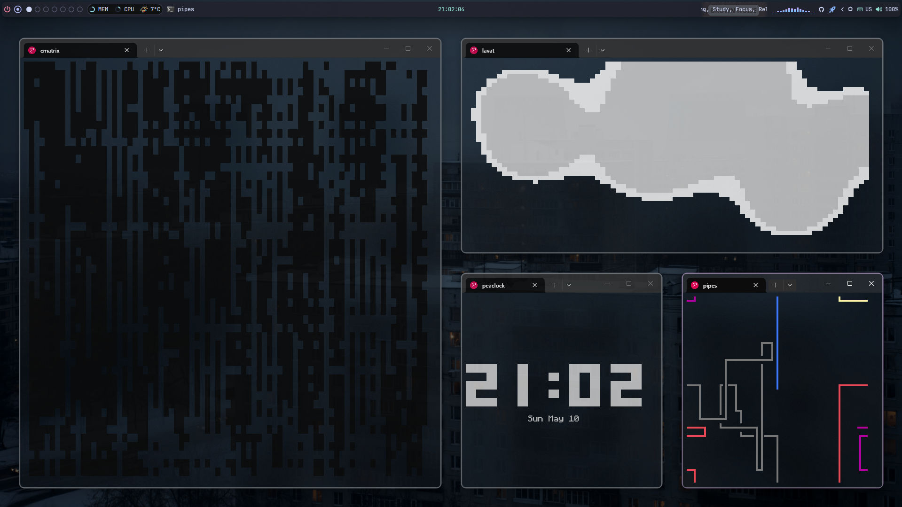

# Minimal Acrylic Rice

A clean, glass-morphic configuration focused on transparency and consistent blur effects across all system components.

---

## Screenshots

<p align="center">
  <table>
    <tr>
      <td align="center"><b>Launchpad</b></td>
      <td align="center"><b>Media Controls</b></td>
    </tr>
    <tr>
      <td></td>
      <td></td>
    </tr>
    <tr>
      <td align="center"><b>Calendar</b></td>
      <td align="center"><b>GitHub Notifications</b></td>
    </tr>
    <tr>
      <td></td>
      <td></td>
    </tr>
    <tr>
      <td align="center"><b>Power Menu</b></td>
      <td align="center"><b>Tiling Indicator</b></td>
    </tr>
    <tr>
      <td></td>
      <td></td>
    </tr>
  </table>
</p>

---

## Features
* **Full Transparency**: Backgrounds are set to `transparent` to let the backdrop blur define the UI.
* **Acrylic Effect**: High-density blur (25px-30px) for a frosted glass aesthetic.
* **Unified Design**: Consistent styling for Launcher, Media Menu, Calendar, and GitHub notifications.
* **Minimalist Borders**: Subtle 1px borders for edge definition without visual clutter.

## Configuration Highlights

### Acrylic Container
The core of the design uses `backdrop-filter` to create the glass effect:
```css
.container {
    background-color: transparent;
    backdrop-filter: blur(25px);
    border: 1px solid rgba(255, 255, 255, 0.1);
}
